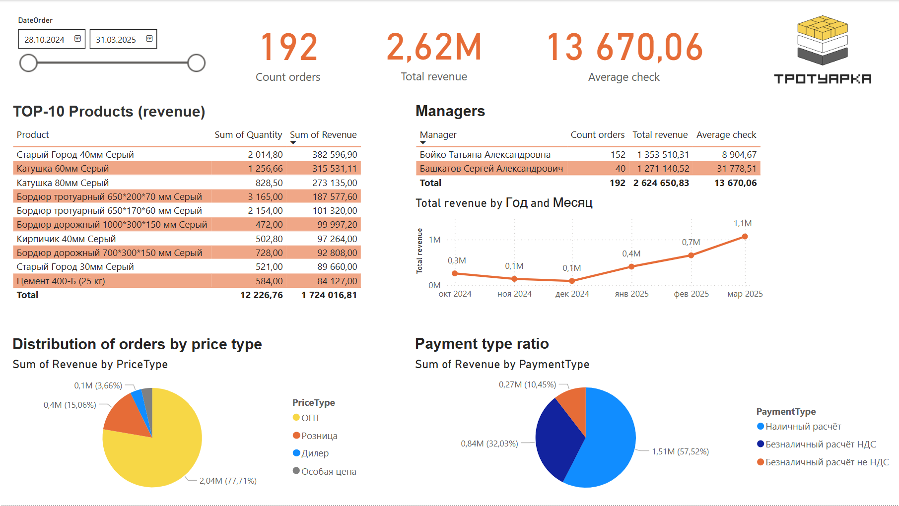

# 🧱 Sales Dashboard: Paving Materials

This Power BI dashboard presents sales analytics for a construction materials company ("Тротуарка") over the period from October 2024 to March 2025.

## 📊 Dashboard Overview

The dashboard includes:

- 📅 **Date slicer** for dynamic filtering
- 🔢 **KPIs**: total orders, total revenue, average check
- 🛒 **TOP-10 products** by revenue
- 👤 **Sales by manager** (orders, revenue, average check)
- 📈 **Revenue trend** by month
- 🧾 **Revenue breakdown by price type**
- 💳 **Payment type ratio**

## 📷 Dashboard Preview

## 🔍 Main Insights

- 🥇 Highest revenue product: *Старый Город 40мм Серый*
- 💼 Manager with the highest average check: *Башкатов Сергей Александрович*
- 📈 Steady revenue growth observed from October to March
- 💰 Most sales fall under *ОПТ* price type
- 🏦 Dominant payment method: *Cash*

## 📁 Files

- `sales_dashboard.pbix` — Power BI dashboard file
- `README.md` — this description

## 🚀 How to Open

1. Download the `.pbix` file
2. Open with [Power BI Desktop](https://powerbi.microsoft.com/)
3. Explore filters and visuals interactively

## 🧠 Skills Demonstrated

- 1C ERP (extracted structured sales data from the 1C system, including product-level order details, manager assignments, and price types)
- MS Excel (transformed exported report into a flat-table format suitable for Power BI, cleaned and normalized column headers and values)
- DAX calculations (e.g., average check, TOP N, distinct count)
- Power Query data transformation
- Visual design and layout optimization
- Data storytelling and business insight extraction

---

🛠 Created by: Sergii Bashkatov  
📅 Date: April 2025  
🌍 Company: Trotuarka 
